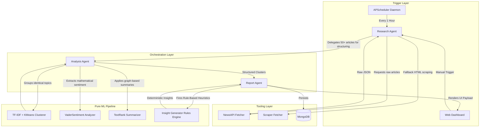

# 🧠 AI News Analyst Engine

**A 100% Offline, Local Multi-Agent Machine Learning Pipeline** designed to aggregate, process, and analyze global breaking news *without* relying on expensive or privacy-invasive generative Large Language Models (LLMs).

---

## 🚀 The Core Advantage
Financial analysts, PR brand managers, and risk assessors currently spend hours manually compiling news, or they risk **massive data leakage** by sending their private strategic queries to third-party LLM providers (like OpenAI) for summarization. 

This engine solves both problems simultaneously:
- **Zero Data Leakage**: All analytics execute 100% locally on your own hardware.
- **Zero API Costs**: No exorbitant generative LLM subscription fees. 
- **Deterministic Insights**: Algorithms are driven by pure mathematics and lexical rules, eliminating AI hallucination risk completely.

---

## ⚙️ Tech Stack

**Backend & ML Engine**
- **Python 3.11** & **FastAPI**: Asynchronous edge-speed API routing.
- **Scikit-Learn**: Drives the semantic `TF-IDF` vectorization and `KMeans` clustering of identical news stories.
- **VaderSentiment**: Mathematically extracts global bias and overall news tone by calculating lexical valences.
- **NetworkX** & **NLTK**: Calculates graph-based Extractive TextRank summaries instead of probabilistic generative summaries.
- **APScheduler**: Daemonized background tasks for autonomous chronological data ingestion.
- **MongoDB**: High-speed, unstructured NoSQL storage solution for clustered documents.

**Frontend UI**
- **Vanilla JS**: Zero-build lightweight client layer bound directly to the FastAPI Backend.
- **CSS3 Glassmorphism**: Stunning, fully custom CSS architecture utilizing staggered animations and interactive nested hover-accordions.

---

## 🏗️ Architecture & Agent Workflow

The underlying system replaces a single massive LLM with three highly specialized logic agents that pass data in a localized pipeline.



---

## 💻 Installation & Usage

Because the entire multi-agent stack is fully containerized, booting the Analyst Engine is incredibly simple.

1. **Clone the repository**:
```bash
git clone https://github.com/YourUsername/AI_News_Analyst.git
cd AI_News_Analyst
```

2. **Configure your API Key**:
Copy `.env.example` to `.env` and insert a free [NewsAPI](https://newsapi.org/) key to allow the Research Agent to read the internet.

3. **Deploy via Docker**:
```bash
docker-compose up -d --build
```
*(Docker will automatically build the API, link the MongoDB instance, download the ML models, and serve the Frontend GUI).*

4. **Access the Dashboard**:
Open your web browser and navigate to: `http://localhost:8000/`
