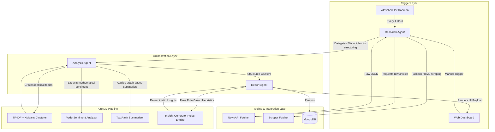

# AI News Analyst Engine: Architecture Document

## System Overview
The **AI News Analyst Engine** is a 100% offline, privacy-focused machine learning pipeline designed to aggregate, process, and analyze global news without relying on generative Large Language Models (LLMs). By utilizing deterministic local ML models and a localized Multi-Agent framework, it ensures data privacy, ultra-low latency, and zero ongoing API costs.

---

## Agent Communication & Data Flow Diagram

---

## 1. Agent Roles & Responsibilities

### 1.1 Research Agent (The Ingestor)
- **Role:** The entry point of the system. It handles user queries from the web dashboard or background cron jobs and pulls raw unstructured data.
- **Integrations:** Wraps the `NewsAPI` client and custom HTML scrapers using `newspaper3k` or `trafilatura`.
- **Output:** Outputs a sanitized array of Python dictionaries containing raw text, URLs, and timestamps stripped of ads and HTML tags.

### 1.2 Analysis Agent (The Data Scientist)
- **Role:** Replaces LLMs by orchestrating standard Python Machine Learning libraries over the data.
- **Integrations:** 
  - Iterates mathematical clustering (`scikit-learn` KMeans) to group identical stories.
  - Generates extractive statistical summaries using PageRank algorithms (`networkx`, NLTK).
  - Captures tone and bias utilizing lexical databases (`vaderSentiment`).

### 1.3 Report Agent (The Presenter)
- **Role:** Takes the mathematically derived analysis and structures it for human consumption.
- **Integrations:** Fires the **Rules Engine** (`insight_generator.py`) to map thresholds (e.g. `Compound Tone < -0.5` -> "Market Risk Insight"). Packages everything into a JSON DOM payload for the FastAPI StaticFiles Web UI.

---

## 2. Error-Handling & Resiliency Logic

Because this agent operates defensively without generative hallucinations, the error-handling logic requires strict typing and fallback states:

1. **Ingestion Fallbacks:** If `NewsAPI` rate limits are hit or the API key is missing, the `ResearchAgent` traps the `HTTP 401/429` exception and relies strictly on the `RSSFetcher` or gracefully returns an empty cluster state to the UI to prevent infinite loading.
2. **Missing Metadata Resiliency:** If the `ScraperFetcher` fails to extract an article's body natively (e.g., paywalls), the `AnalysisAgent` drops the article from the `Tf-Idf` vector matrix *before* clustering to prevent mathematical skewing.
3. **Empty Cluster Protection:** If the topic is extremely niche and only returns 1 article, the `scikit-learn` KMeans implementation overrides the default $k=3$ cluster sizing to $k=1$, preventing a runtime `ValueError`. 
4. **Daemon Traps:** The background `APScheduler` wraps all recurrent tasks in broad `try/except` logic mapping to `logging.error()`, preventing a single corrupted scheduled job from crashing the entire FastAPI asynchronous event loop.
